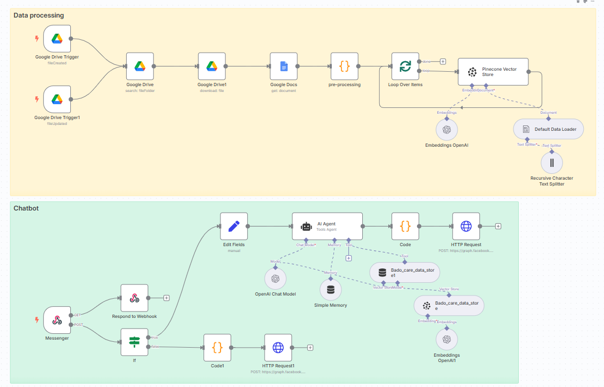

# N8N RAG Chatbot

A Facebook Messenger chatbot built with n8n that uses Retrieval-Augmented Generation (RAG) to provide intelligent responses. The bot leverages Pinecone Vector Store for document storage and OpenAI's API for embeddings and language processing.

## 📊 Workflow Visualization



*The complete n8n workflow showing the integration between Facebook Messenger, OpenAI, and Pinecone Vector Store*

## 🚀 Features

- **Facebook Messenger Integration**: Seamless webhook-based communication
- **RAG Implementation**: Advanced document retrieval with vector embeddings
- **Vector Database**: Pinecone integration for efficient similarity search
- **AI-Powered Responses**: OpenAI API for intelligent conversation handling
- **No-Code Automation**: Built entirely with n8n workflow automation
- **Containerized Deployment**: Docker-based setup with ngrok tunneling

## 🛠️ Tech Stack

- **Language**: JavaScript
- **Automation Platform**: n8n
- **Vector Database**: Pinecone Vector Store
- **AI/ML**: OpenAI API (Embeddings & Chat)
- **Messaging Platform**: Facebook Messenger
- **Containerization**: Docker & Docker Compose
- **Tunneling**: ngrok for HTTPS endpoint

## 📋 Prerequisites

Before you begin, ensure you have:

- Docker and Docker Compose installed
- Facebook Developer Account with Messenger App configured
- OpenAI API key
- Pinecone account and API key
- ngrok account (optional, for tunneling)

## 🚀 Quick Start

### 1. Clone and Setup

```bash
git clone <repository-url>
cd n8n_RAG_chatbot
```

### 2. Configure Environment

1. Open `docker-compose.yml`
2. Replace all `...` placeholders with your actual values:
   - Container name
   - N8N_EDITOR_BASE_URL (your domain or ngrok URL)
   - WEBHOOK_URL (your webhook endpoint)
   - NGROK_AUTHTOKEN (your ngrok auth token)
   - ngrok domain

### 3. Start Services

```bash
docker-compose up -d
```

This will start:
- n8n automation platform on port 5555
- ngrok tunnel for HTTPS access on port 4040

### 4. Import Workflow

1. Access n8n at `http://localhost:5555`
2. Navigate to **Workflows** → **Import from File**
3. Select the `workflow.json` file
4. Configure your credentials:
   - OpenAI API key
   - Pinecone API key and environment
   - Facebook App credentials

### 5. Configure Facebook Webhook

1. Go to [Facebook Developers](https://developers.facebook.com/)
2. Navigate to your Messenger app
3. Set webhook URL to your ngrok/domain endpoint
4. Configure webhook subscriptions for messages
5. Replace placeholder values with your Facebook app credentials

## ⚙️ Configuration

### Environment Variables

| Variable | Description | Required |
|----------|-------------|----------|
| `N8N_PORT` | n8n service port | ✅ |
| `N8N_EDITOR_BASE_URL` | Public URL for n8n editor | ✅ |
| `WEBHOOK_URL` | Facebook webhook endpoint | ✅ |
| `NGROK_AUTHTOKEN` | ngrok authentication token | ⚠️ |

### API Keys Required

- **OpenAI API Key**: For embeddings and chat completions
- **Pinecone API Key**: For vector database operations
- **Facebook App Secret**: For webhook verification
- **Facebook Page Access Token**: For sending messages

## 📁 Project Structure

```
n8n_RAG_chatbot/
├── docker-compose.yml         # Docker services configuration
├── workflow.json              # n8n workflow definition
├── work_flow-visualization.png # Workflow diagram
├── README.md                  # This file
├── n8n_data/                 # n8n persistent data (auto-created)
└── local_data/               # Local file storage (auto-created)
```

## 🔧 Usage

1. **Start the services** using Docker Compose
2. **Import the workflow** into n8n
3. **Configure all credentials** in the workflow nodes
4. **Test the webhook** endpoint
5. **Start chatting** with your bot on Facebook Messenger

## 🤝 Contributing

1. Fork the repository
2. Create a feature branch (`git checkout -b feature/amazing-feature`)
3. Commit your changes (`git commit -m 'Add some amazing feature'`)
4. Push to the branch (`git push origin feature/amazing-feature`)
5. Open a Pull Request

## 📝 License

This project is licensed under the MIT License - see the [LICENSE](LICENSE) file for details.

## 🆘 Support

If you encounter any issues or have questions:

1. Check the [Issues](../../issues) section
2. Review n8n [documentation](https://docs.n8n.io/)
3. Consult Facebook [Messenger Platform docs](https://developers.facebook.com/docs/messenger-platform/)

## 🙏 Acknowledgments

- [n8n](https://n8n.io/) - Workflow automation platform
- [Pinecone](https://www.pinecone.io/) - Vector database
- [OpenAI](https://openai.com/) - AI/ML API services
- [ngrok](https://ngrok.com/) - Secure tunneling service